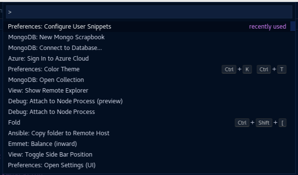
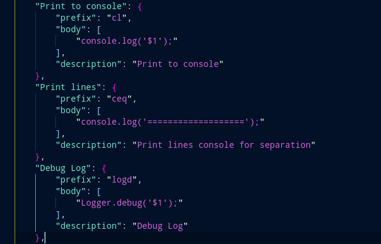

Open the Snippets option using below steps
1. View >> Commands Palette (Ctrl + Shift + P)
2. Search for 'Snippets'
   

3. Click on 'Preferences: Configure User Snippets'
4. Select language Ex - Javascript
5. Add contents into json file.
6. To add the snippet content in any js file, start typing the prefix you had mentioned.
7. Select any option (Ex- Javascript, Python, etc )
8. Add custom snippets.

Ex - Sample Javascript snippets

Once, the snippet file is saved, open any js file & start typing the "prefix" which we provided.
Our snippet will appear as a suggestion here. Clicking on it will add the code to our file.

_Note_: Sometimes, in our snippet there will be location where we will have to add manual values.
We can use placeholders like $1, $2, etc for this. $1 refers to first location where manual value is to be added.
